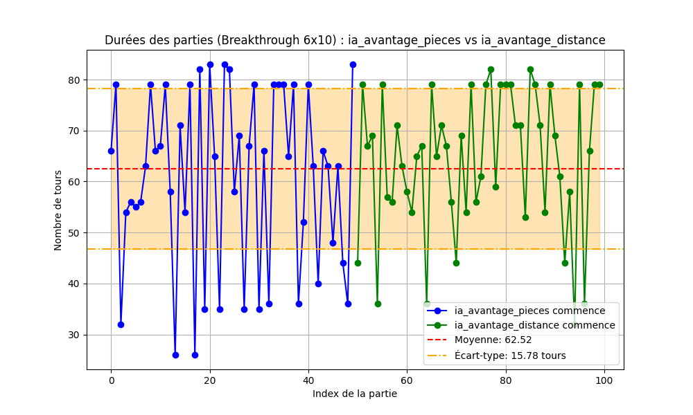

# IA pour le jeu de plateau Breakthrough

### Exécution

### Pré-requis

- Pike (https://pike.lysator.liu.se/)
- Compilateur g++  

### Lancer une partie en ligne de commande

Compiler et lancer l'executable depuis le répertoire de build `players` :
```
cd tp1-breakthrough
make && ./players/player1
```

Jouer un coup sur une grille 6x10 et afficher l'état du plateau :
```
newgame 6 10
genmove
showboard
```

### Executer le script de test

Le script `run.sh` permet de faire un premier test rapide du programme.

```
cd tp1-breakthrough
./run.sh
```

### Executer plusieurs parties et générer des fichiers de logs

Le script `mk_stats.sh` permet de lancer plusieurs parties entre deux joueurs et consulter les logs dans un répertoire `new_stats`.  
Il est possible de configurer le nom des deux programmes, le nombre de parties et la configuration de la grille dans le script.

```
cd tp1-breakthrough
./mk_stats.sh
```

### Executer plusieurs parties à l'aide de la commande pike

Le script `run_many_games.pike` peut être executé pour faire jouer deux programmes en ajustant des options de configuration.  
Les options sont renseignés au début du script.

Commande pour lancer 10 parties entre `player1` et `player2` sur une grille 6x10 avec une limite d'une seconde de temps de réflexion :
```
cd tp1-breakthrough
pike run_many_games.pike -f ./players/player1 -s ./players/player2 -v 1 -p 1 -l 6 -c 4 -n 10
```

## Paramètres du programme ids_player.cpp

| Paramètre                        | Description                                                                                       |
|-----------------------------------|---------------------------------------------------------------------------------------------------|
| `IDS_MAX_DEPTH`                   | Définit la profondeur maximale de recherche itérative.      |
| `FIRST_MOVE_RANDOM`               | Détermine si le premier coup de chaque joueur doit être aléatoire (`1` pour oui, `0` sinon).    |
| `PLAYER_NAME`                     | Définit le nom du joueur.                                                   |
| `verbose`                         | Active l'affichage détaillé des informations pendant l'exécution.         |
| `debug`                           | Mode debug pour suivre les étapes de recherche IDS / DLS.    |
| `showboard_at_each_move`         | Permet d'afficher le plateau de jeu après chaque coup.                     |


## Heuristique d'évaluation

La fonction d'heuristique implémentée prend en compte deux critères pour évaluer l'état du jeu et attribuer un score à un joueur donné.

**1. Différence du nombre de pions ⚪⚫**

Un joueur obtient un avantage s'il possède plus de pions sur le plateau et une pénalité s'il en a moins.

- **Poids : 0.3**  
  → La différence de pions est importante, mais ne doit pas dominer l'évaluation.  
  → L'impact direct sur la victoire est moindre comparé à l'avancée des pions.

**2. Distance cumulée des pions vers la ligne d'arrivée 🎯**

On évalue la progression des pions vers la ligne d'arrivée adverse en mesurant la distance de chaque pion.

- **Poids : 0.7**  
  → Plus un pion est avancé, plus son influence est forte.  
  → La promotion des pions étant la condition principale de victoire.

---

L'évaluation finale d'un état de jeu combine ces deux critères avec leurs poids respectifs :  

**Formule de l'heuristique :**  
Score = `0.3 × (Différence de pions) + 0.7 × (Avancée vers l'objectif)`

## Résultat de parties
 
 (voir répertoire `/old_stats`)


## Analyse des longueurs de partie

Le script `plots/draw_game_durations_plot.py` permet de créer un plot des longueurs de partie à partir des logs présents dans le répertoire `new_stats`.

### Exemple d'analyse graphique

Paramètres de **ia_avantage_pieces** et **ia_avantage_distance** :
- Recherche IDS
- Profondeur 2
- Premier coup aléatoire pour les deux joueurs
- poids d'heuristique inversés entre les deux joueurs


