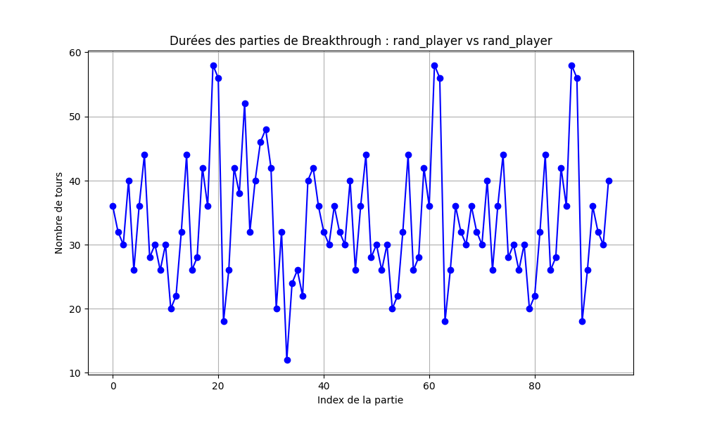
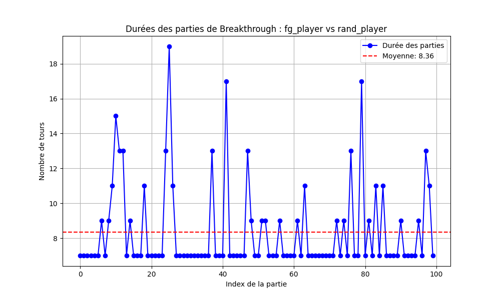
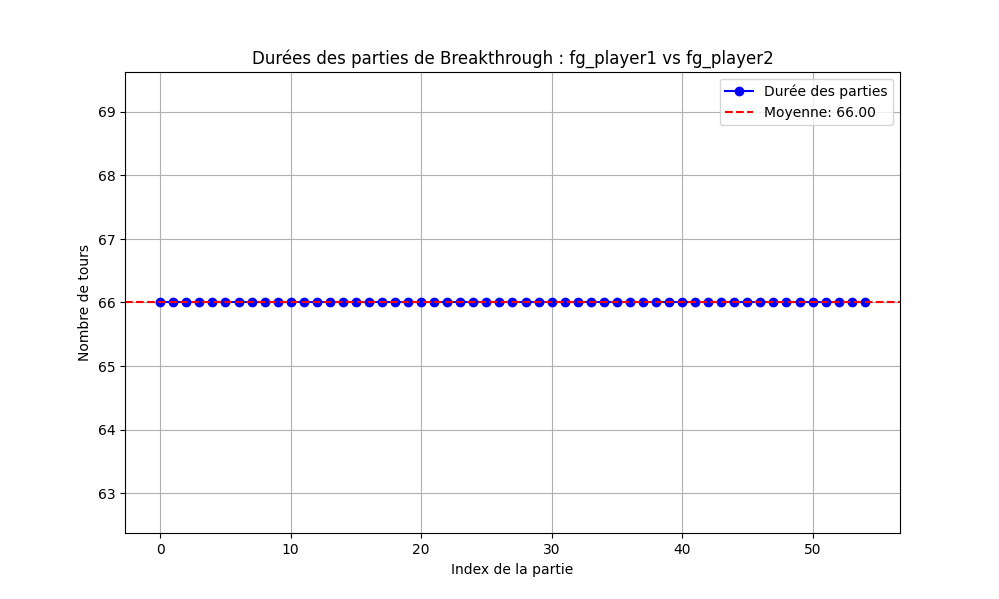
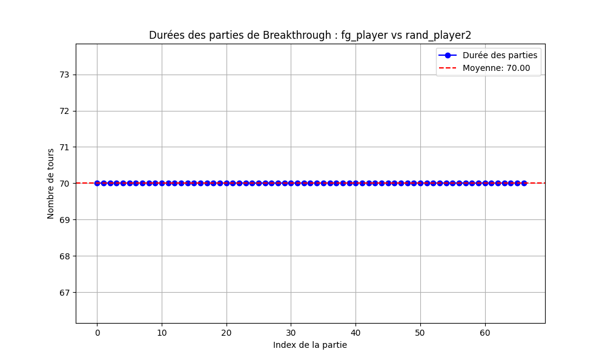

# Heuristique d'évaluation

- 2 critères principaux pour évaluer l'état du jeu et attribuer un score à un joueur donné.

## 1. Différence du nombre de pions ⚪⚫

Un joueur obtient un avantage s'il possède plus de pions sur le plateau et une pénalité s'il en a moins.

- **Poids : 0.3**  
  → La différence de pions est importante, mais ne doit pas dominer l'évaluation.  
  → L'impact direct sur la victoire est moindre comparé à l'avancée des pions.

## 2. Distance cumulée des pions vers la ligne d'arrivée 🎯

On évalue la progression des pions vers la ligne d'arrivée adverse en mesurant la distance de chaque pion.

- **Poids : 0.7**  
  → Plus un pion est avancé, plus son influence est forte.  
  → La promotion des pions étant la condition principale de victoire.

---

L'évaluation finale d'un état de jeu combine ces deux critères avec leurs poids respectifs :  

**Formule de l'heuristique :**  
Score = `0.3 × (Différence de pions) + 0.7 × (Avancée vers l'objectif)`


# Résultat obtenus

## rand_player vs rand_player

**100 parties**  
Moyenne longueur : 33.58 tours  
Écart-type       : 9.83 tours




## fg_player vs rand_player

Moyenne longueur : 8.36  
Écart-type       : 2.54

| Joueur      | Parties Jouées | Parties Gagnées | % Victoires |
|-------------|---------------|-----------------|------------- |
| fg_player   | 100           | 100             | 100%         |
| rand_player | 100           | 0               | 0%           |



## fg_player vs fg_player2 (depth=2)

Moyenne longueur : 66.00  
Écart-type       : 0.0

| Joueur      | Parties Jouées | Parties Gagnées | % Victoires |
|-------------|---------------|-----------------|------------- |
| fg_player   | 100           | 100             | 100%         |
| fg_player2  | 100           | 0               | 0%           |



## fg_player (depth=2) vs fg_player2 (depth=3)

Moyenne coups d'une partie : 70.0  
Écart-type                 : 0

| Joueur      | Parties Jouées | Parties Gagnées | % Victoires |
|-------------|--------------|-----------------|--------------- |
| fg_player   | 70           | 0               | 0%             |
| fg_payer2   | 70           | 100             | 1000%          |



## Répertoire /plots

- Le répertoire `plots/` contient un script pour générer un graphe de durée de parties à partir d'un des fichiers stockés dans `data/`

Installation de la librairie python matplotlib dans un environnement virtuel:

```
python -m venv .env
source .env/bin/activate
pip install matplotlib
```

Lancer le script python :

```
python create_game_length_plot.py <Joueur1> <Joueur2> ../data/<nom-fichier>
```

## Commande de lancement de 100 parties entre 2 joueurs sur une grille 6*10

```
pike run_many_games.pike -f ./fg_player -s ./fg_player2 -v 0 -p 1 -l 6 -c 10 -n 100
```

Un fichier txt est sauvegardé dans `data/` pour stocker le nombre de tours de chaque partie (séparé par des `;`) 